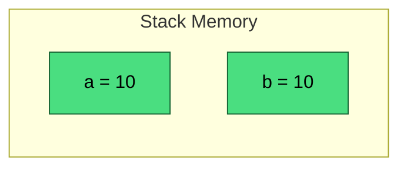
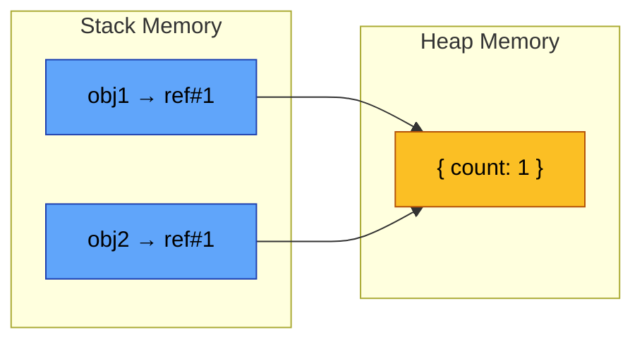
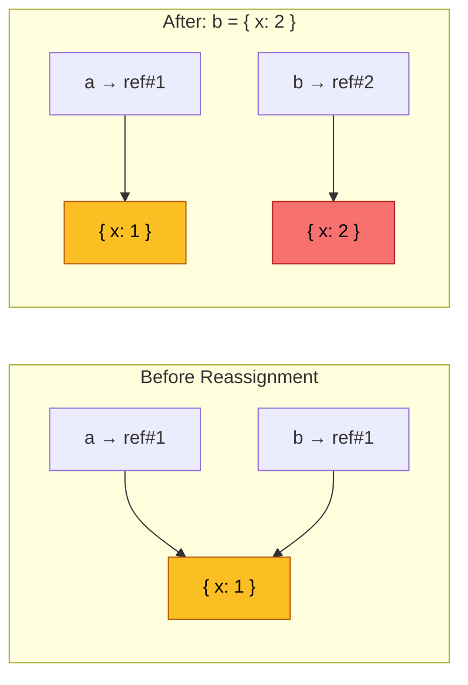
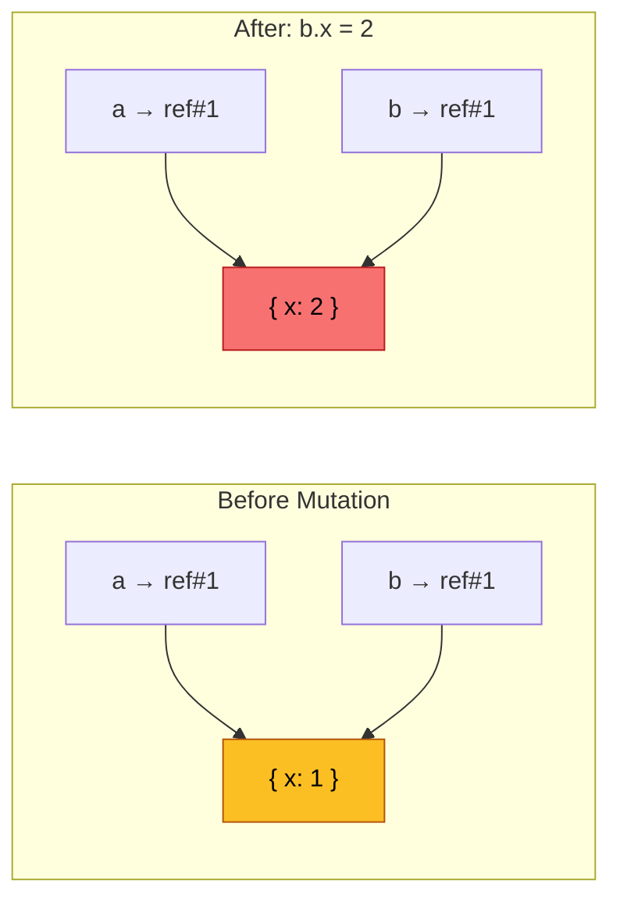
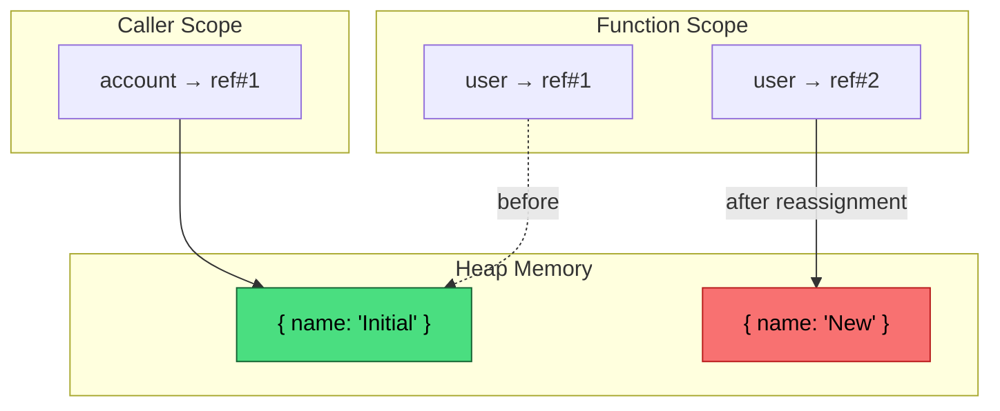
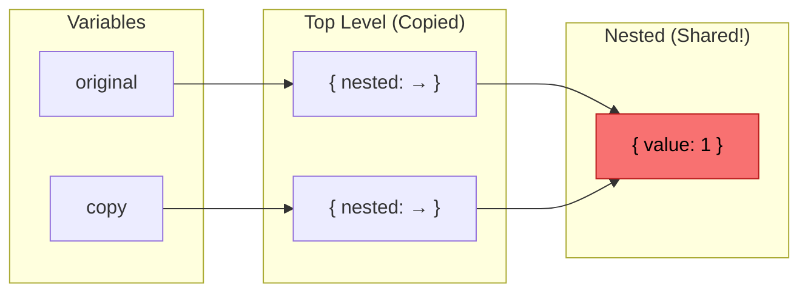
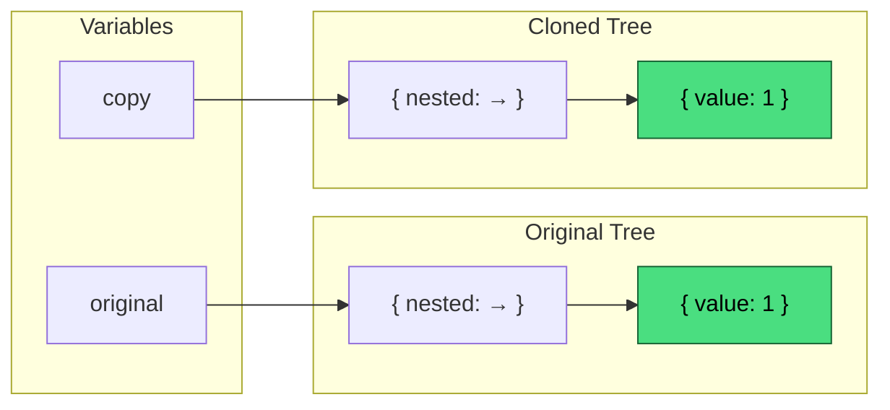
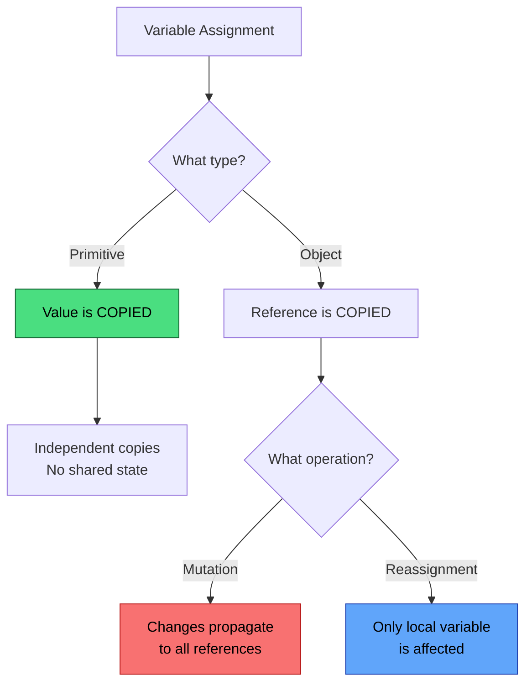

# Value vs Reference in JavaScript: The Mental Model That Never Breaks

> **TL;DR:** JavaScript is *always* pass-by-value. For **primitives** (string, number, boolean, etc.), the value is the actual data. For **objects** (arrays, functions, objects), the value is a *reference* to the data. Mutations propagate through all references, but reassignments do not.

---

## Quick Reference

| Concept | Behavior |
|---------|----------|
| **Primitives** | Immutable; copied by value |
| **Objects** | Mutable by default; variables store references |
| **Mutation** | Changes the object (propagates to all references) |
| **Reassignment** | Replaces the reference (doesn't propagate) |
| **Shallow Copy** | Only top-level is copied; nested objects are shared |
| **Deep Copy** | All levels are duplicated; no shared state |

---

## Table of Contents

- [The One Rule You Must Remember](#the-one-rule-you-must-remember)
- [Two Categories of Data](#two-categories-of-data-in-javascript)
- [How Memory Works: Visualized](#how-memory-works-visualized)
- [Reassignment vs Mutation](#reassignment-vs-mutation-critical-distinction)
- [Function Arguments](#function-arguments-the-most-misunderstood-part)
- [Object Comparison](#object-comparison-identity-matters)
- [Copying Objects](#copying-objects-shallow-vs-deep)
- [Common Bugs and Fixes](#common-bugs-caused-by-misunderstanding-references)
- [Interview Self-Check](#interview-self-check)

---

## The One Rule You Must Remember

**JavaScript is always pass-by-value.**

There are no exceptions.

What confuses developers is *what the value actually is*:

- **For primitives** → the value is the data itself
- **For objects** → the value is a *reference* to the data

Everything else follows from this foundational concept.

---

## Two Categories of Data in JavaScript

### Primitives (Value Types)

JavaScript has seven primitive types: `string`, `number`, `bigint`, `boolean`, `undefined`, `symbol`, and `null`.

**Key properties:**

- ✅ Immutable — cannot be changed after creation
- ✅ Copied by value — assignments create independent copies
- ✅ No shared state — changing one variable never affects another

```javascript
let a = 10;
let b = a;

b = 20;

console.log(a); // 10
console.log(b); // 20
```

### Objects (Reference Types)

Everything that isn't a primitive is an object: `{}`, `[]`, functions, `Date`, `Map`, `Set`, class instances.

```javascript
const obj1 = { count: 1 };
const obj2 = obj1;

obj2.count = 2;

console.log(obj1.count); // 2
```

Both variables point to the **same object** in memory — mutating it affects all references.

---

## How Memory Works: Visualized

Understanding *where* data lives in memory is the key to mastering this concept.

### Primitives: Each Variable Gets Its Own Copy



When you assign `let b = a`, the value `10` is **copied**. Each variable holds its own independent value.

```javascript
let a = 10;
let b = a;    // b gets a COPY of 10
b = 20;       // Only b changes
// a is still 10
```

### Objects: Variables Share a Reference


> ℹ️ These diagrams represent a conceptual model; actual JavaScript engines may optimize memory differently.

When you assign `const obj2 = obj1`, only the **reference** is copied — both variables point to the same object.

```javascript
const obj1 = { count: 1 };
const obj2 = obj1;  // obj2 gets a COPY of the reference
obj2.count = 2;     // Mutates the shared object
// obj1.count is now 2
```

---

## Reassignment vs Mutation (Critical Distinction)

This is where most confusion happens. Let's visualize both scenarios.

### Reassignment Creates a New Reference



```javascript
let a = { x: 1 };
let b = a;

b = { x: 2 };  // Reassignment — b points to NEW object

console.log(a.x); // 1  ← unchanged
console.log(b.x); // 2
```

### Mutation Modifies the Shared Object



```javascript
let a = { x: 1 };
let b = a;

b.x = 2;  // Mutation — modifies the SAME object

console.log(a.x); // 2  ← changed!
console.log(b.x); // 2
```

---

## Function Arguments: The Most Misunderstood Part

JavaScript uses **call-by-sharing** — the function receives a copy of the reference, not the reference itself.

### Mutation Persists Outside the Function

```javascript
function update(user) {
  user.name = "Updated";
}

const account = { name: "Initial" };
update(account);

console.log(account.name); // "Updated"
```

The function mutates the **same object** that `account` references.

### Reassignment Stays Local

```javascript
function replace(user) {
  user = { name: "New" };  // Local reassignment only
}

const account = { name: "Initial" };
replace(account);

console.log(account.name); // "Initial"  ← unchanged
```

The local parameter `user` was pointed to a new object, but `account` still references the original.



---

## Object Comparison: Identity Matters

```javascript
{} === {}   // false
[] === []   // false
```

Each literal creates a **new object** with a unique reference. JavaScript compares objects by **identity** (reference), not by structure.

```javascript
const a = {};
const b = a;

a === b; // true  ← same reference
```

---

## Copying Objects: Shallow vs Deep

### Shallow Copy (Spread Operator)

```javascript
const original = { nested: { value: 1 } };
const copy = { ...original };

copy.nested.value = 99;

console.log(original.nested.value); // 99  ← also changed!
```



### Deep Copy (`structuredClone`)

> ⚠️ **Availability note:**  
> Use `structuredClone()` for deep copies. It is available in modern browsers and Node.js **v17+**.

```javascript
const original = { nested: { value: 1 } };
const copy = structuredClone(original);

copy.nested.value = 99;

console.log(original.nested.value); // 1  ← unchanged
```



---

## Common Bugs Caused by Misunderstanding References

### Bug 1: Mutating Shared Default Values

```javascript
// ❌ BAD
const defaultConfig = { timeout: 5000 };

function setup(config = defaultConfig) {
  config.timeout = 10000;  // Mutates defaultConfig globally!
}

// ✅ FIX
function setup(config = {}) {
  const local = { ...defaultConfig, ...config };
}
```

### Bug 2: Assuming Spread Is a Deep Copy

```javascript
// ❌ BAD
const copy = { ...obj };
copy.nested.value = 1;  // Mutates original!

// ✅ FIX
const copy = structuredClone(obj);
```

---

## How to Prevent Accidental Mutations

### Defensive Deep Copy

```javascript
function process(data) {
  const local = structuredClone(data);
  // Safe to modify
  return local;
}
```

### Object.freeze (Shallow Only)

```javascript
const config = Object.freeze({ timeout: 5000 });
config.timeout = 10000;  // Silently fails (throws `TypeError` in strict mode)
```

> ⚠️ `Object.freeze()` is shallow — nested objects must be frozen separately.

---

## The Correct Mental Model (Summary)



**Remember:**

- Primitives → copied by value
- Objects → referenced by value
- Mutations → propagate
- Reassignments → don't propagate
- JavaScript → **always pass-by-value**

---

## Interview Self-Check

Test your understanding — try answering each question before revealing the answer.

### 1. Why does `{} !== {}` return `true`?

<details>
<summary>Reveal Answer</summary>

Each `{}` literal creates a **new object** in memory with its own unique reference. JavaScript compares objects by **identity** (reference), not by structure. Since these are two different objects at two different memory addresses, they are not equal.

```javascript
const a = {};
const b = {};
a === b  // false — different references

const c = a;
a === c  // true — same reference
```

</details>

### 2. Why does mutation escape function scope but reassignment doesn't?

<details>
<summary>Reveal Answer</summary>

When you pass an object to a function, the function receives a **copy of the reference** — not the object itself, and not the original reference variable.

- **Mutation** modifies the object that both references point to → changes persist
- **Reassignment** only changes what the local copy points to → caller's variable is unaffected

```javascript
function mutate(obj) { obj.x = 2; }      // Modifies shared object ✓
function reassign(obj) { obj = {x: 2}; } // Only changes local copy ✗
```

</details>

### 3. Why does the spread operator only create a shallow copy?

<details>
<summary>Reveal Answer</summary>

The spread operator `{...obj}` copies each property's **value** into a new object. For primitive properties, this creates independent copies. But for nested objects, the "value" being copied is a **reference** — so both the original and the copy point to the same nested object.

```javascript
const original = { nested: { x: 1 } };
const copy = { ...original };

// copy.nested === original.nested (same reference!)
```

Use `structuredClone()` for deep copies.

</details>

### 4. Why is JavaScript not pass-by-reference?

<details>
<summary>Reveal Answer</summary>

In true pass-by-reference (like C++ with `&`), the function receives the **actual variable** from the caller — reassigning it would change the caller's variable.

JavaScript is **pass-by-value**. For objects, the value passed is a reference, but it's a **copy** of that reference. Reassigning the parameter creates a new local binding; it cannot affect the caller's variable.

```javascript
function tryToReplace(arr) {
  arr = [1, 2, 3];  // Only reassigns local parameter
}

const myArray = [];
tryToReplace(myArray);
console.log(myArray);  // [] — unchanged (this wouldn't happen with true pass-by-reference)
```

</details>

### 5. Why can two variables affect the same object?

<details>
<summary>Reveal Answer</summary>

Variables don't store objects — they store **references** to objects. When you assign one variable to another (`const b = a`), you copy the reference, not the object. Both variables now point to the same object in memory, so mutating through either variable affects the shared object.

```javascript
const a = { count: 0 };
const b = a;  // b receives a copy of the reference

b.count++;
console.log(a.count);  // 1 — same object
```

</details>

---

## Closing Thoughts

This concept is **foundational**. Closures, immutability, state management, performance optimization, and Node.js memory behavior all depend on it.

If your mental model here is correct, everything else builds cleanly.

---

## Further Reading

- <a href="https://developer.mozilla.org/en-US/docs/Glossary/Primitive" target="_blank" rel="noopener">MDN: Primitive Values</a>
- <a href="https://developer.mozilla.org/en-US/docs/Web/API/structuredClone" target="_blank" rel="noopener">MDN: structuredClone()</a>
- <a href="https://javascript.info/object-copy" target="_blank" rel="noopener">JavaScript.info: Object References and Copying</a>

---

*Last updated: January 2026*
